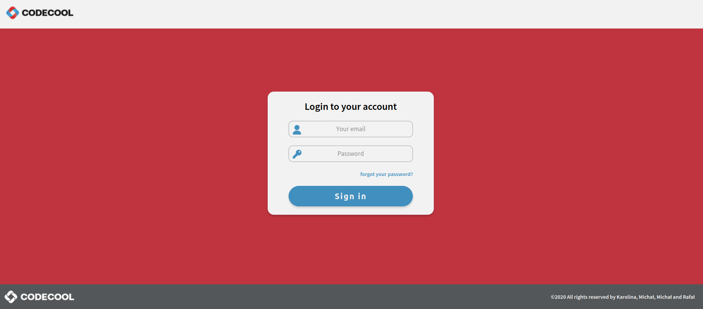

# Queststore - JavaEE full-stack web application
Queststore is a web app for Codecool students to achieve quests and win artifacts, in order to **enhance and gamify learning process**.

The project itself was created by group of 4 students during the period of 6 weeks. It was an independent work of the team, starting from preparing DB structure and class graphs, creating logos, web designs, to execution and testing.

## General info
Portal has been divided into two parts: 
* **CMS for admins and mentors** - thanks to which people managing students in Codecool have a chance to add, edit, delete and view all students, teams, classes, quests and artifacts available in the portal.
* **online portal for students** - here students can log in, view available quests and artifacts, buy them, and see/edit details of their accounts, as well as their teams. 

## Features
### DONE: Admin portal/CMS
#### Log in as admin/mentor or student
A person can log in to the website, depending on their role. Unauthorized access is prevented using servlet filters.

After loging in, the user's session is created and configured. User can also easily log out.

#### Dashboard with summary of items existing in DB
After logging in to admin's/mentor's section, the dashboard is displayed. Here a user can view basic Codecool statistics and find links leading to dedicated sections.

#### List view for all sections
As typical for CMS's layout, a user can view all available elements: mentors, admins, classes, teams, students, quests and artifacts.
Sorting lists is possible for all tables.

#### Add new elements
Also, for all available sections, admin has a possibility to add new elements. Forms used for that purpose are fully validated.

#### Edit and delete elements
It is also possible to edit previously entered elements. This part was most challenging, since classes are connected - you can add student to class, team to student, artifacts to team etc.
All inputs are validated and all actions result in messages, for better UX.

#### Error handling
Due to used filters and configurations, most errors that were not handled earlier, are redirected to error page. However, most of them are dealt with before that happens, e.g. by communicating which data was entered incorrectly.

### TO COMPLETE: Students portal
Due to complexity of the project, CMS part was delivered in 95%, but students website was created only on frontend side. It consists of following elements:
#### Marketing/general purpose dashboard

The dashboard of student's portal is more visually appealing than CMS, to encourage students to use it. It is also 100% responsive.

#### View for quests and artifacts
From the dashboard, students can go to quests and artifacts sections, to view or buy available ones.

#### Team and personal details
Since studying requires a lot of team effort, students can view their team's statistics and buy artifacts collectively.

## Technologies
* Java 13
* HTML 5
* CSS
* Java EE
* JSP
* PostgreSQL
* Junit 5
* Maven
* Mockito
* Jetty server
* Figma (for graphic designs)

## Setup
To run the app, a person needs to have all mentioned software installed. 
Next steps: 
* running psql scripts from "resources" folder
* running jetty server from console or using IntelliJ configurations (jetty:run)
* opening browser and running localhost

## Status
Project is not finished, but probably will no longer be continued (since it's only for educational purposes).

## Credits
Project supervised by Codecool mentors.
